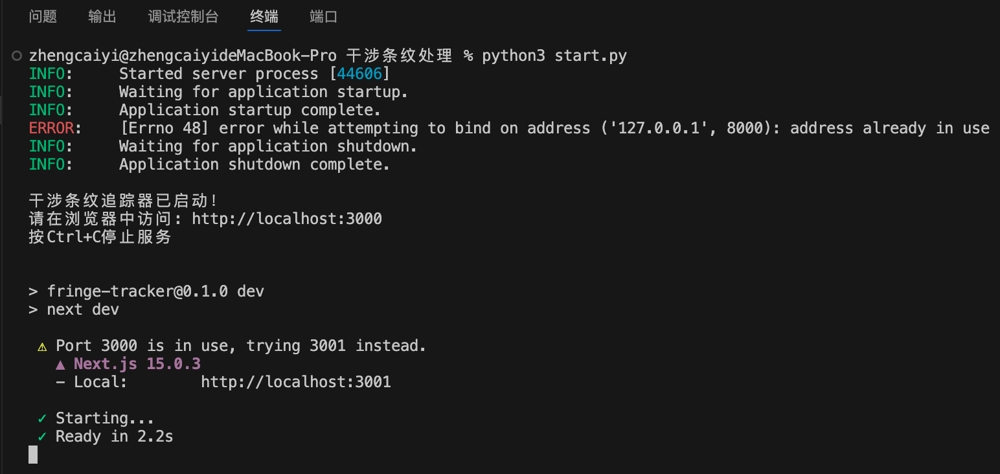
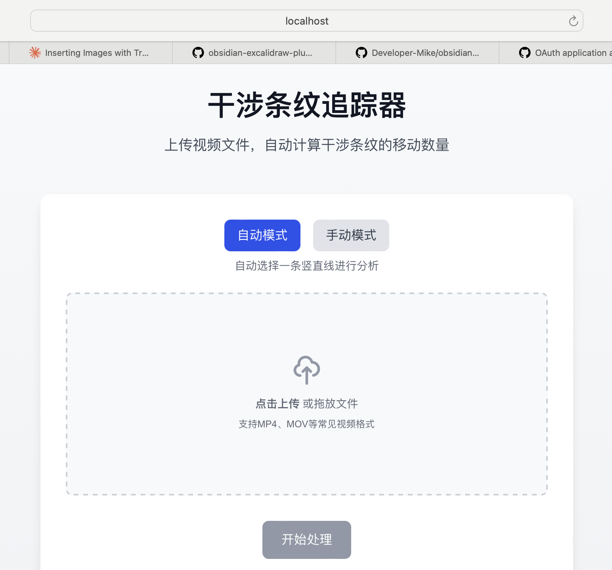
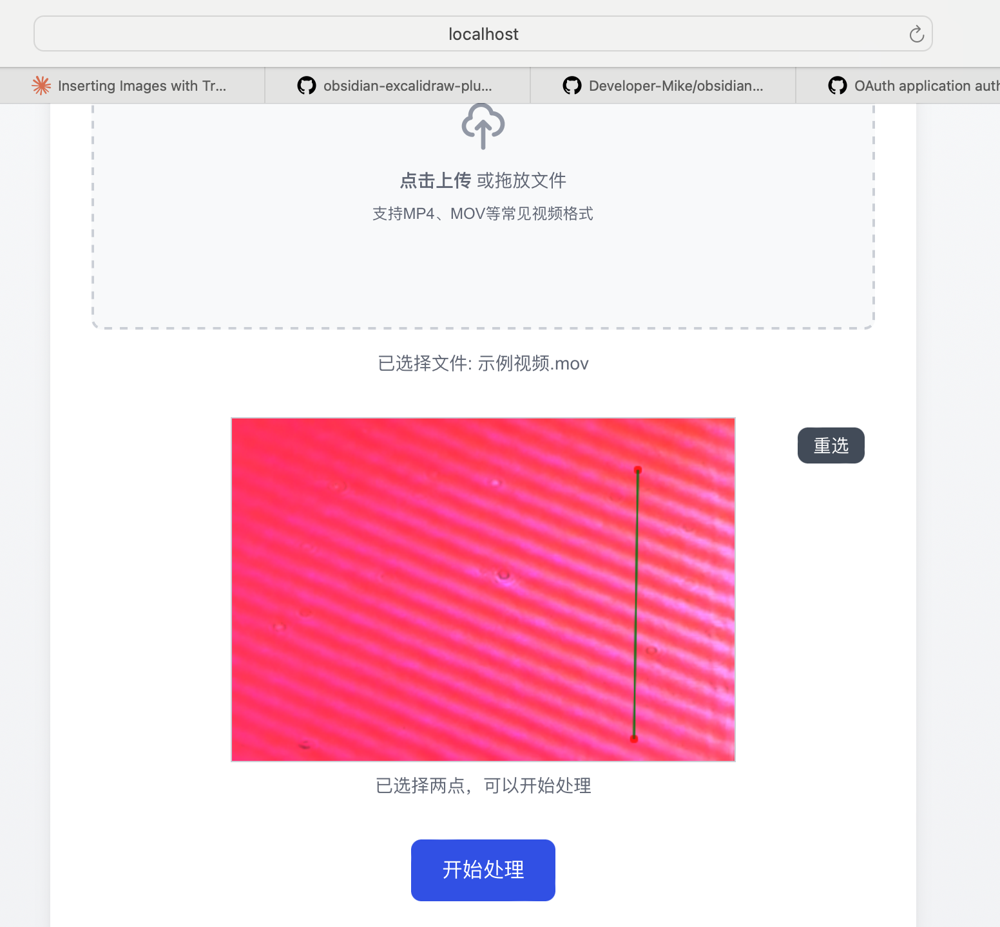
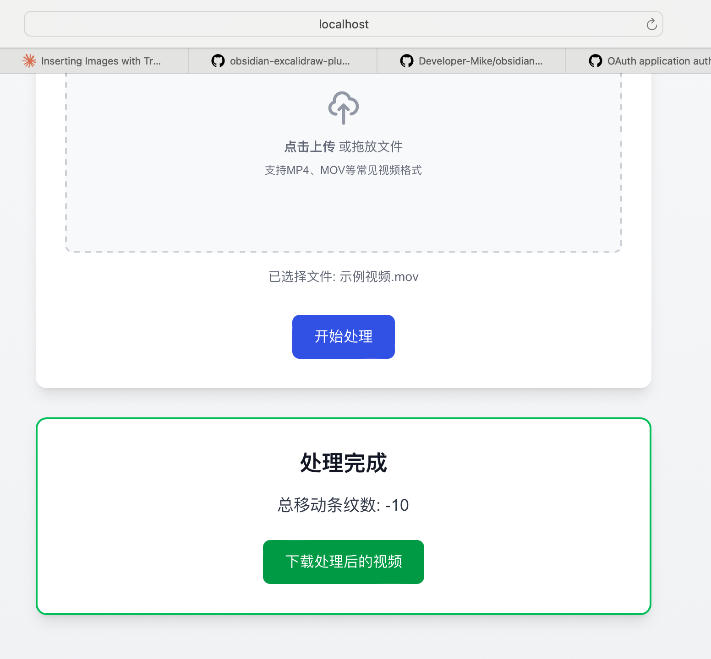
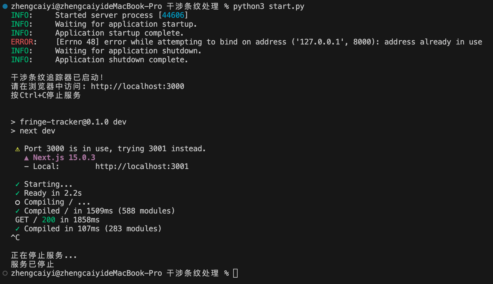

# 干涉条纹追踪器

这是一个基于Web的干涉条纹追踪系统，可以自动分析视频中的干涉条纹移动并计数。系统提供了直观的用户界面，支持自动和手动两种追踪模式。

## 功能特点

- 🎥 支持常见视频格式（MP4、MOV等）
- 🔄 实时处理视频并显示追踪结果
- 📊 自动计算条纹移动总数
- 🎯 支持自动/手动选择追踪基准线
- 💾 可下载处理后的视频文件

## 环境要求

### 后端
- Python 3.x
- FastAPI
- OpenCV
- NumPy
- SciPy
- uvicorn

### 前端
- Node.js
- npm/yarn
- Next.js 13+

## 安装步骤

1. 克隆仓库：
```bash
git clone [repository-url]
cd [repository-name]
```

2. 安装后端依赖：
```bash
pip install fastapi uvicorn opencv-python numpy scipy python-multipart
```

3. 安装前端依赖：
```bash
cd fringe-tracker
npm install
```

## 示例视频

项目中包含了一个示例视频文件 `干涉视频demo.mov`，您可以使用这个视频来测试系统的功能。这个视频展示了典型的干涉条纹移动场景，非常适合用来熟悉系统的操作和验证系统的工作情况。

## 使用方法

1. 启动应用：
```bash
python start.py
```
这将同时启动后端服务器（端口8000）和前端开发服务器（端口3000）。

2. 在浏览器中访问：
```
http://localhost:3000
```

3. 使用流程：
   - 选择处理模式（自动/手动）
   - 上传视频文件（可以使用提供的示例视频 `干涉视频demo.mov`）
   - 如果是手动模式，在视频第一帧上选择两个点确定基准线
   - 点击"开始处理"
   - 等待处理完成后下载结果视频

### 具体流程
1. 克隆到本地后运行start.py文件
   
2. 打开网址http://localhost:3001
   
3. 推荐选择手动模式，挑选一条竖着的清晰的区域
   
4. 处理完成后，给出结果
   
5. 在终端中按"ctrl + c"退出
   

## 工作原理

1. 视频处理流程：
   - 预处理：灰度转换、直方图均衡化、降噪
   - 基准线提取：获取选定线上的强度分布
   - 峰值检测：使用Savitzky-Golay滤波和峰值检测算法
   - 条纹追踪：实时追踪峰值移动
   - 移动计数：根据峰值位移计算条纹数

2. 系统架构：
   - 前端：Next.js + TailwindCSS构建的现代UI
   - 后端：FastAPI提供RESTful API
   - 处理引擎：基于OpenCV和SciPy的视频处理模块

[在此处添加系统架构图]

## 项目结构

```
.
├── start.py           # 启动脚本
├── api.py            # 后端API实现
├── 干涉视频demo.mov   # 示例视频文件
└── fringe-tracker/   # 前端项目
    ├── app/         # Next.js应用
    ├── public/      # 静态资源
    └── package.json # 项目配置
```

## 注意事项

- 确保视频中的干涉条纹清晰可见
- 手动模式下，建议选择垂直于条纹方向的基准线
- 处理大型视频文件可能需要较长时间
- 建议使用Chrome或Firefox浏览器以获得最佳体验

## 许可证

MIT License

## 贡献

欢迎提交问题和改进建议！
